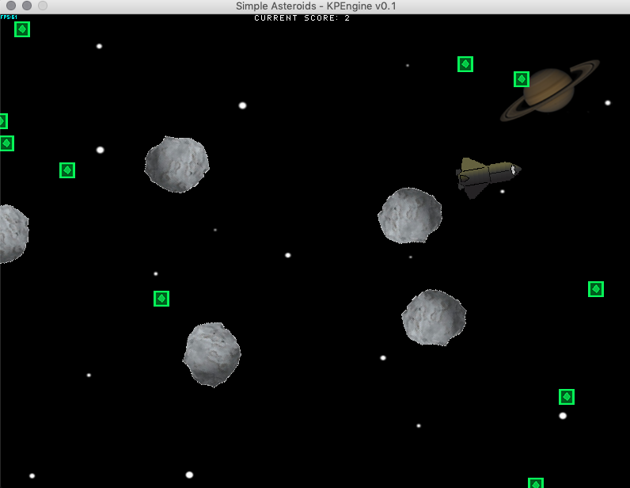

# KP Game Engine v0.1
### Written by Kyle Peeler

Basic game engine written in Java with minimal dependencies written for my CSCI 437 Game Development class. Games are implemented by implementing methods defined in AbstractGame class. See BasicGame in the Game directory for an example game. Source code of the GameEngine is found within `src/io.kylepeeler/GameEngine`. Resources for the game are found in the `/res` directory.

## Example Game Directions:
The goal of the example game is to move the space ship around with the WASD keys (or arrow keys) and collect gems without running into any asteroids. You may need to focus the window that is created in order for the Keyboard Event Listeners to fire. If you run into an asteroid, you can restart the game using the 'R' key.

## Example Game Screenshot:

## Compiling the example game
First make sure you have the latest version of Java installed. In order to compile the game, use the included Makefile. To use it, `cd` into the root directory of the project and run `make build`.

## Running the example game
To run the game, use the included make file. To use it, `cd` into the root directory of the project and run `make run`.