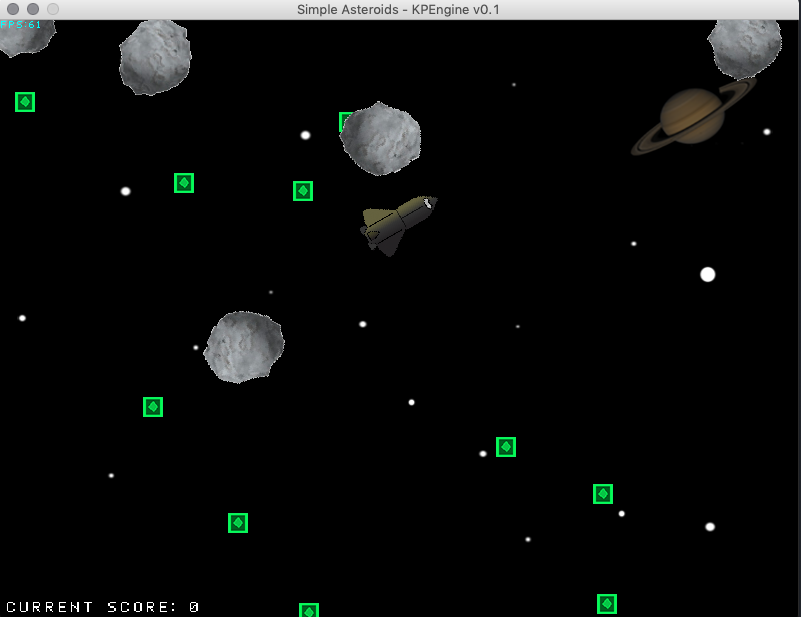

# KP Game Engine v0.1
### Written by Kyle Peeler

Basic game engine written in Java with minimal dependencies written for my CSCI 437 Game Development class. Games are implemented by implementing methods defined in AbstractGame class. See BasicGame in the Game directory for an example.

## Example Game Screenshot:

## Running the example game
To run the example game, use the included makefile. First `cd` into the directory of the game and run `make run`.